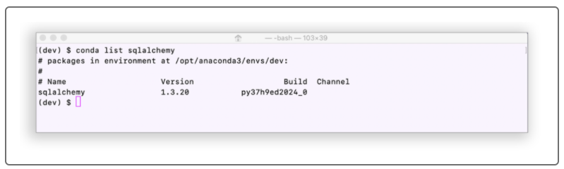
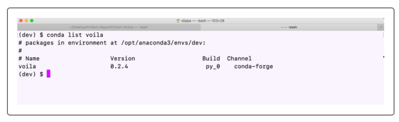

# ETF_Analyzer
Building a financial database and web application by using SQL, Python, and the Voilà library to analyze the performance of a hypothetical fintech ETF.

---

## Technologies

This project leverages python 3.7 with the following packages:

**[Numpy Library](https://numpy.org/)** - For calculations and working with efficient arrays.<br>

**[Pandas Library](https://pandas.pydata.org/)** For financial data statistical calculations.<br>

**[hvPlot Library](https://hvplot.holoviz.org/)** - For plotting our calculated statistical data.<br>

**[SQLAlchemy](https://docs.sqlalchemy.org/en/14/)** - For making SQL queries to read and store data.<br>

**[Voila](https://voila.readthedocs.io/en/stable/index.html)** - To convert our code into a web application

---

## Installation Guide

In this Getting Started guide, you’ll set up the tools that you need for this module, which include:

SQLAlchemy

Voilà

Let’s start with SQLAlchemy.

### <span color='blue'>Install SQLAlchemy</span>

SQLAlchemy is an open-source SQL library for Python. It’s designed to ease the communication between Python-based programs and databases. The SQLAlchemy library should have installed on your computer as part of the Anaconda download.

To confirm that SQLAlchemy installed in your Conda dev environment, open a terminal window, and then complete the following steps:

Activate your Conda dev environment.

Run the following command:

```python
conda list sqlalchemy
```

If SQLAlchemy is already installed, sqlalchemy and its version number will display in your terminal, as the following image shows. In this case, you don’t need to do anything further for SQLAlchemy. Move to the next section to install Voilà.



If sqlalchemy doesn’t display in your terminal, you need to install it. To do so, follow these steps:

With your Conda dev environment still active, run the following command:

```python
pip install SQLAlchemy
```

When the installation completes, confirm it by running the following command:

```python
conda list sqlalchemy
```

Note that your terminal should now display sqlalchemy and its version number, as the previous image shows.

### <span color='blue'>Install Voilà</span>

To install Voilà, open a terminal window, and then complete the following steps:

Activate your Conda dev environment.

Run the following command:

```python
conda install -c conda-forge voila
```

Confirm that the installation succeeded by running the following command:

```python
conda list voila
```

If Voilà successfully installed, voila and its version number will display in your terminal window, as the following image shows:



